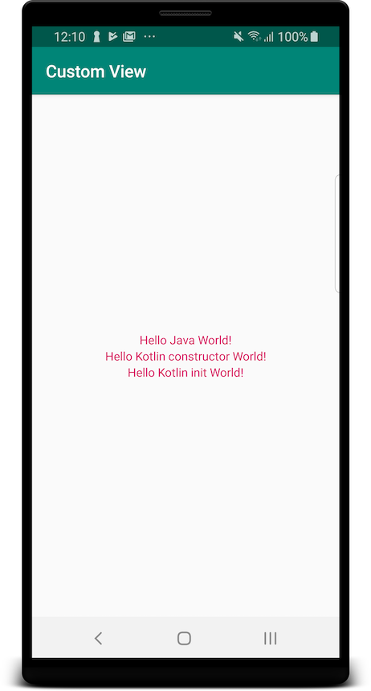

# Custom view constructors

Main activity layout uses three custom views:

    <com.github.arekolek.customview.CustomJavaTextView
        style="@style/CustomStyle"
        android:text="!dlroW avaJ olleH"
        />

    <com.github.arekolek.customview.CustomKotlinConstructorTextView
        style="@style/CustomStyle"
        android:text="!dlroW rotcurtsnoc niltoK olleH"
        />

    <com.github.arekolek.customview.CustomKotlinInitTextView
        style="@style/CustomStyle"
        android:text="!dlroW tini niltoK olleH"
        />
        
They all use a style with red text and have their text reversed.
They extend `AppCompatTextView` and let it take care of the style,
by defining a 2-argument constructor and delegating to the 2-argument constructor in super class.
They also reverse the text in their own constructors.
The result is this:

